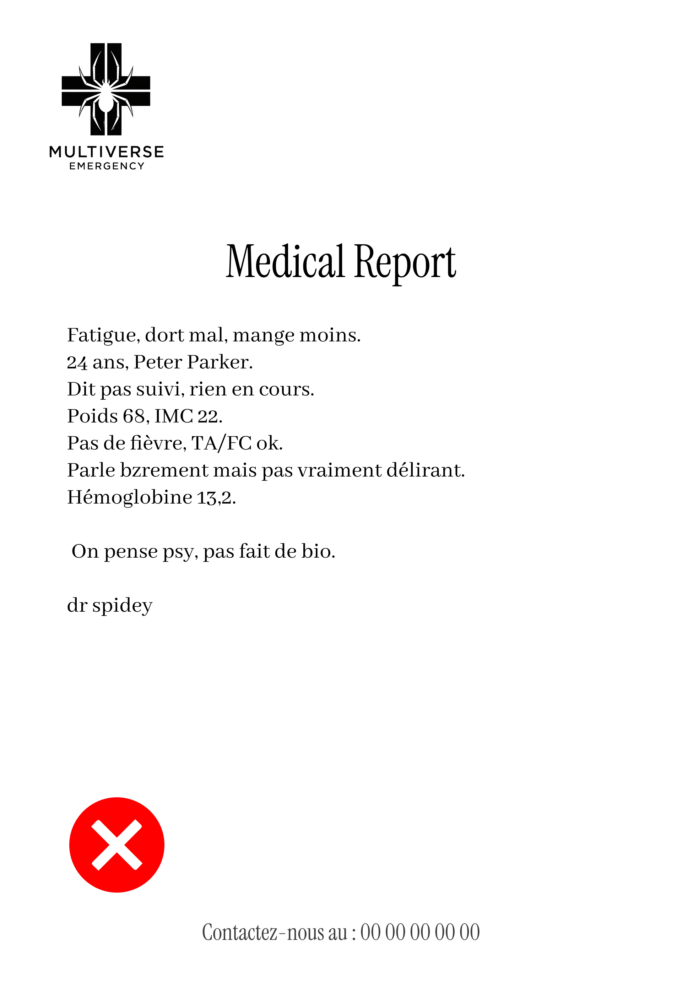

<div align="center">
  
</div>

<div align="center">
  <strong>Open-source AI platform for French medical report processing</strong>
</div>

<div align="center">
  <a href="https://github.com/spideystreet/corelia/blob/main/LICENSE">
    
  </a>
  <a href="https://github.com/spideystreet/corelia">
    
  </a>
</div>

---

## What is Corelia?

Corelia is an open-source AI platform designed to transform unstructured French medical reports into structured, actionable insights. Built specifically for French healthcare, it leverages advanced natural language processing to extract medical entities and map them to ICD-10-FR codes, ensuring compliance and data sovereignty.

## The Problem

Each year, over 80% of medical notes generated in French hospitals remain as unstructured text that cannot be exploited - representing more than 50 million annual documents whose medical, administrative, and epidemiological value remains largely underutilized.

## Our Solution

Corelia provides a sovereign AI platform that:

- **Enhances** unstructured medical reports into clean, standardized formats
- **Extracts** medical entities using specialized French-trained models  
- **Maps** entities to ICD-10-FR codes for regulatory compliance
- **Reduces** manual coding time by 50-70%

## Before vs After

<div align="center">

**Before Corelia** | **After Corelia**
:---:|:---:
 | 
*Unstructured, handwritten notes* | *Structured, standardized report*

</div>

## ICD-10-FR Code Proposals

<div align="center">
  
  <br><em>AI-generated code suggestions for medical validation</em>
</div>

## Key Features

- 🇫🇷 **French-First Design** - Built specifically for French medical terminology
- 🔒 **Data Sovereignty** - SecNumCloud certified infrastructure
- 📊 **High Accuracy** - >90% accuracy rates in medical entity extraction
- 🏥 **Healthcare Compliance** - Full ICD-10-FR compatibility
- 🔓 **Open Source** - Transparent and community-driven development


<div align="center">
  
</div>


## Getting Started

```bash
# Clone the repository
git clone https://github.com/spideystreet/corelia.git
cd corelia

# Install dependencies
uv sync

# Run the application
python main.py
```

## Documentation

📚 **[Full Documentation](https://spideystreet.github.io/corelia)** - Complete guides, API reference, and examples

## License

This project is licensed under the AGPL-3.0 License - see the [LICENSE](LICENSE) file for details.

## Vision

By 2030, Corelia aims to become the standard infrastructure for French medical AI, processing millions of medical documents daily while maintaining the highest standards of privacy, security, and medical accuracy.

---

<div align="center">
  <strong>Built with ❤️ for French Healthcare</strong>
</div>
