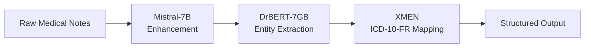

# System Architecture

## Pipeline Overview

Corelia implements a three-stage AI pipeline for processing medical notes:

## Component Details

### 1. Mistral-7B Medical Enhancement

**Purpose**: Enhance and normalize French medical notes through specialized fine-tuning

**base-model**: [Mistral-7B](https://huggingface.co/mistralai/Mistral-7B-Instruct-v0.1)  
**Training**: Native French language processing with medical specialization  
**Fine-tuning**: LoRA (Low-Rank Adaptation) for efficient medical domain adaptation  
**Sequence Length**: 2048 tokens  

**Fine-tuning Strategy**: Our approach adapts the generalist Mistral-7B model to French medical note generation and structuring through LoRA fine-tuning on an optimized mix of medical datasets. 
This method adds lightweight adaptive matrices to the base model, ensuring high performance while maintaining resource efficiency and fast deployment capabilities.  

**Training Datasets**  
**[NACHOS](https://huggingface.co/datasets/chapin/NACHOS_large) (~50%)**: Maximum coverage of French medical vocabulary and knowledge  
**[MediQAl](https://huggingface.co/datasets/Abirate/mediqal) (~25%)**: Question-answering and clinical reasoning learning with instruction-following structure  
**[FRASIMED](https://huggingface.co/datasets/alicelacaille/FRASIMED) (~15%)**: Annotated clinical cases providing contextual diversity for realistic note generation  
**Clinical Notes Corpus (~10%)**: Pairs of poorly structured → standardized notes for target task optimization  

**Stratified Sampling**: During fine-tuning, we use stratified sampling across these corpora without prior physical fusion.  
Each training batch contains varied examples from all sources, optimizing transfer learning, medical domain robustness, and adaptability to the specific structuring task.  

**Capabilities**: The fine-tuned model generates well-structured French medical notes with relevant terminology and optimal adaptation to clinical context.  
It provides robust performance against stylistic and structural variations in notes through corpus diversity, effectively creating the French equivalent of "BioMistral" with a linguistic and medical foundation truly adapted to French healthcare usage.  

### 2. DrBERT-7GB Entity Extraction

**Purpose**: Extract medical entities and annotations from enhanced text using Named Entity Recognition (NER)

**base-model**: [DrBERT-7GB](https://huggingface.co/Dr-BERT/DrBERT-7GB)  
**Specialization**: French biomedical and clinical domains  
**Training**: French hospital corpus with additional fine-tuning  
**Architecture**: BERT-based  
**Language**: French-optimized  

**Capabilities**: The model excels at Named Entity Recognition (NER) for medical terms, identifying diseases, symptoms, treatments, and medications with high accuracy. 
It performs clinical concept extraction, understanding complex medical relationships and contexts. 
The system demonstrates superior French medical terminology understanding, including regional variations and specialized vocabulary. 
It effectively recognizes medical acronyms and codes, crucial for French healthcare documentation.

### 3. XMEN ICD-10-FR Mapping

**Purpose**: Map extracted entities to standardized medical codes

**Tool**: [XMEN](https://github.com/hpi-dhc/xmen)  
**Function**: Medical entity recognition and coding  
**Target**: ICD-10-FR (French version of ICD-10)  
**Integration**: Automated mapping pipeline  

**Capabilities**: The system provides automated medical coding, reducing manual effort and human error in the coding process. 
It ensures full ICD-10-FR compliance, meeting French healthcare regulatory requirements. 
The entity-to-code mapping functionality accurately translates medical concepts into standardized codes. 
This standardization enables seamless interoperability with existing French healthcare information systems.

## Data Flow

### Input Processing
1. **Raw Medical Notes**: Unstructured French text from hospital systems
2. **Preprocessing**: Text cleaning and normalization
3. **Medical Enhancement**: LoRA fine-tuned Mistral-7B generates structured French medical notes with proper terminology and clinical context

### Entity Extraction
1. **Enhanced Text**: Processed by DrBERT for entity recognition
2. **Medical Entities**: Extracted clinical concepts, diagnoses, treatments
3. **Structured Data**: Organized medical information

### Code Mapping
1. **Extracted Entities**: Fed into XMEN for coding
2. **ICD-10-FR Codes**: Standardized medical classifications
3. **Final Output**: Structured, coded medical data

## Technical Specifications

*Technical specifications and performance metrics are currently under development and will be updated as the project progresses.*

## Dataset Mapping Tables

### Field Mapping Across Datasets

The following table shows how common data fields are mapped across the three main datasets used in our training pipeline:

| Description | MantraGSC | QUAERO | MedicalNER_Fr |
|-------------|-----------|--------|---------------|
| **Text/document identifier** | `document_id` | `doc_id` | `sample_id / sentence_id` |
| **Annotated text content** | `text` | `text` | `text` |
| **Start and end offset of entity** | `start, end` | `start_offset, end_offset` | `start, end (ou ner_tags_span/)` |
| **Named entity text** | `span` | `mention / entity` | `entity / ner_tags_span` |
| **Entity type (Disease, Chemical...)** | `label` | `semantic_group` | `label / ner_tags / ner_tags_span` |
| **Concept identifier (UMLS/CUI if available)** | `cui` | `concept_id` | `cui (si présent)` |
| **Annotation source (optional)** | `source` | `source` | `-` |

### Entity Type Mapping

This table shows how different entity types are aligned across the three datasets:

| Merged Concept | MantraGSC | QUAERO | MedicalNER_Fr |
|----------------|-----------|--------|---------------|
| **Concept fusionné** | MantraGSC | QUAERO | MedicalNER_Fr |
| **Anatomy** | Anatomy | Anatomy | AnatomicalStructure |
| **Disease/Disorder** | Disorder | Disorder | Disease |
| **Chemical/Drug** | Substance | Chemical and Drugs | Medication/Vaccine |
| **Device** | Device | Device | Device |
| **Procedure** | Procedure | Procedure | MedicalProcedure |
| **Symptom** | Symptom | Symptom | Symptom |
| **Phenomenon** | Phenomenon | Phenomenon | - |
| **Physiology** | Physiology | Physiology | - |
| **LivingBeing** | LivingBeing | LivingBeing | - |
| **Object** | Object | Object | - |
| **Geography** | Geography | Geographic Areas | - |
| **LOC/PER/CW/PROD...** | - | - | LOC, PER, CW, PROD |

### Mapping Strategy

Our pipeline handles these mappings through:

1. **Unified Schema**: We maintain a canonical entity type schema that accommodates all dataset variations
2. **Flexible Parsing**: The preprocessing stage normalizes field names and entity types across datasets
3. **Cross-Dataset Training**: During fine-tuning, we ensure the models learn from the full spectrum of entity types and naming conventions
4. **Robust Inference**: At inference time, the system can handle various input formats and automatically map them to our internal representation
