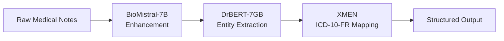

# System Architecture

## Pipeline Overview

Corelia implements a three-stage AI pipeline for processing medical notes:

## Component Details

### 1. BioMistral-7B Enhancement

**Purpose**: Improve and standardize medical notes before processing

**Model**: [BioMistral-7B](https://huggingface.co/BioMistral/BioMistral-7B)
- Base: Mistral-7B-Instruct-v0.1
- Training: Further pre-trained on PubMed Central
- Specialization: Biomedical domain
- Sequence Length: 2048 tokens

**Capabilities**: The model provides text enhancement and standardization capabilities, ensuring medical terminology normalization across different writing styles and formats. It significantly improves the quality of unstructured notes by correcting grammatical errors, standardizing abbreviations, and ensuring consistent medical terminology usage.

### 2. DrBERT-7GB Entity Extraction

**Purpose**: Extract medical entities and annotations from enhanced text

**Model**: [DrBERT-7GB](https://huggingface.co/Dr-BERT/DrBERT-7GB)
- Specialization: French biomedical and clinical domains
- Training: French hospital corpus
- Architecture: BERT-based
- Language: French-optimized

**Capabilities**: The model excels at Named Entity Recognition (NER) for medical terms, identifying diseases, symptoms, treatments, and medications with high accuracy. It performs clinical concept extraction, understanding complex medical relationships and contexts. The system demonstrates superior French medical terminology understanding, including regional variations and specialized vocabulary. It effectively recognizes medical acronyms and codes, crucial for French healthcare documentation.

### 3. XMEN ICD-10-FR Mapping

**Purpose**: Map extracted entities to standardized medical codes

**Tool**: [XMEN](https://github.com/hpi-dhc/xmen)
- Function: Medical entity recognition and coding
- Target: ICD-10-FR (French version of ICD-10)
- Integration: Automated mapping pipeline

**Capabilities**: The system provides automated medical coding, reducing manual effort and human error in the coding process. It ensures full ICD-10-FR compliance, meeting French healthcare regulatory requirements. The entity-to-code mapping functionality accurately translates medical concepts into standardized codes. This standardization enables seamless interoperability with existing French healthcare information systems.

## Data Flow

### Input Processing
1. **Raw Medical Notes**: Unstructured text from hospital systems
2. **Preprocessing**: Text cleaning and normalization
3. **Enhancement**: BioMistral improves text quality and structure

### Entity Extraction
1. **Enhanced Text**: Processed by DrBERT for entity recognition
2. **Medical Entities**: Extracted clinical concepts, diagnoses, treatments
3. **Structured Data**: Organized medical information

### Code Mapping
1. **Extracted Entities**: Fed into XMEN for coding
2. **ICD-10-FR Codes**: Standardized medical classifications
3. **Final Output**: Structured, coded medical data

## Technical Specifications

### Model Performance
- **BioMistral-7B**: 2048 token sequence length, biomedical domain specialization
- **DrBERT-7GB**: BERT-based architecture, French hospital corpus training
- **XMEN**: Automated ICD-10-FR mapping with high accuracy rates

### Processing Capabilities
- **Input**: Unstructured medical text in French
- **Output**: Structured medical entities with ICD-10-FR codes
- **Throughput**: Optimized for batch and real-time processing
- **Accuracy**: High precision medical entity recognition and coding

### System Integration
- **APIs**: RESTful interfaces for seamless integration
- **Standards**: FHIR, SNDS compatibility for French healthcare systems
- **Formats**: JSON output with standardized medical coding
- **Interoperability**: Direct integration with hospital information systems
