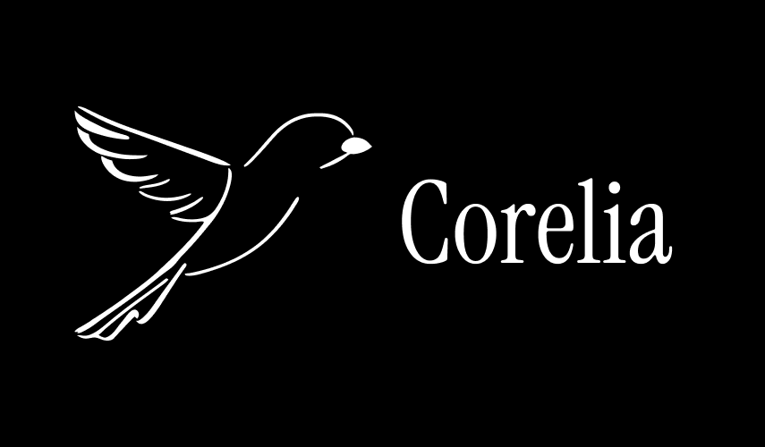
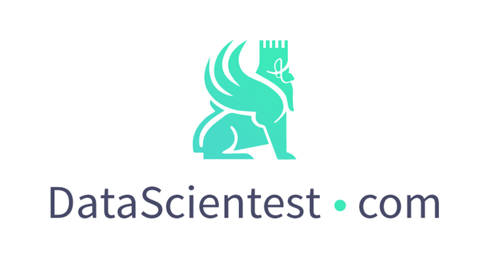

# Welcome to Corelia

  

**French Medical LLM - BioMistral for French Healthcare**

## Research Project Context

  
  
<em>Final Capstone Project - Data Engineer Apprenticeship Program</em>

Corelia represents my **final capstone project** at **DataScientest**, but it's more than just an academic exercise. This research addresses a real gap in French healthcare AI: while BioMistral has revolutionized English medical applications, there's no equivalent specialized model for French medicine.

## The Challenge We're Solving

French medical AI faces unique challenges that English models can't address: 

**Medical terminology** differs significantly between languages  
**Healthcare systems** have country-specific practices and regulations  
**Clinical reasoning** patterns vary across cultures  
**Coding standards** like ICD-10-FR require specialized understanding  

## Our Research Strategy

We're building the largest French medical corpus ever assembled by combining multiple open-source medical data sources with targeted web crawling techniques. This comprehensive dataset will enable continual pre-training of Mistral-7B, creating a model that truly understands French medical context.

**The vision**: A sovereign French medical AI that can support healthcare professionals, researchers, and institutions with accurate, culturally-aware medical language understanding.

## Documentation

- **[Architecture](architecture.md)**: Research pipeline and technical implementation
- **[Datas](datasets.md)**: Medical-Commons dataset and data sources
- **[Research Insights](research-insights.md)**: Technical choices and research findings
- **[Security & Compliance](security-compliance.md)**: EU AI Act compliance and data protection

## Vision

Create the first specialized French medical LLM, contributing to the development of sovereign AI tools for French healthcare.

---

*This documentation is built with [MkDocs](https://www.mkdocs.org) and the [Material theme](https://squidfunk.github.io/mkdocs-material/).*
